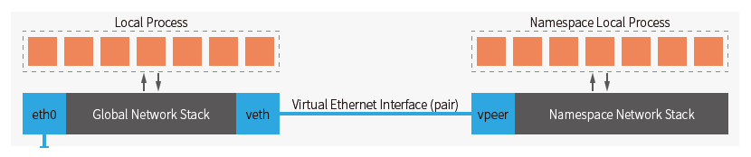

# VETC

VETC (Virtual Ethernet Traffic Control) 是一个配置虚拟以太网接口以及自动配置 NAT 到外部网络的快速单文件脚本。

由于虚拟以太网独立的网络栈的特性，可以简易地配置延迟、丢包、重复、乱序、速率限制双向的流量控制规则。

仅支持 IPv4

虚拟以太网设备和网络命名空间示意图：

## 基本用法

直接进入 bash 交互模式:

    $ vetc odelay 200ms bash
    $ ping -c xxx.net
    $ ip a
    $ exit

输入 exit 安全退出 bash 时会自动清理相关配置。

常驻启动和清理:

    $ vetc up
    $ vetc down

配置端口 8080 映射到外部网络, 发送到外部网络的数据延迟 200ms 网络速率 80kbit:
    
    $ vetc 8080/tcp odelay 200ms orate 80kbit

创建一个 1MB 的临时文件以供测试

    dd if=/dev/zero of=testdlfile bs=1MB count=1 oflag=dsync

在虚拟网络环境中启动 python 内置的 web 服务器:

    $ vetc exec python3 -m http.server 8080

## 完整命令行参数

命令形式

    qos_conn.bash [ VERBOSE ] [ u|up ]
    qos_conn.bash [ VERBOSE ] get GETOPT
    qos_conn.bash [ VERBOSE ] [ d|down ]
    qos_conn.bash [ VERBOSE ] [ NETCONFIG ... ] exec [ ARG... ]
    qos_conn.bash [ VERBOSE ] [ NETCONFIG ... ] bash

    GETOPT := { veth | veth_addr | vpeer | vpeer_addr  }
    VERBOSE := { v[erbose] }
    NETCONFIG := { PORT_FORWARD | TRAFFIC_CONTROL }
    PORT_FORWARD := { [PORT]/tcp | [PORT]/udp }
    TRAFFIC_CONTROL := { [i|o]delay TIME [CORRELATION] |
                        [i|o]loss PERCENT [CORRELATION] |
                        [i|o]duplicate PERCENT [CORRELATION] |
                        [i|o]reorder PERCENT [CORRELATION] |
                        [i|o]rate RATE }
### GETOPT

输出当前配置值:

    $ vetc get veth

### VERBOSE

提供 v|verbose 选项进行完整的日志输出:

    $ vetc v up

### NETCONFIG

网络配置有两种: 一种为流量控制 (TRAFFIC_CONTROL)，一种为端口转发(PORT_FORWARD)。

### PORT_FORWARD

端口转发可以将外部指定端口流量NAT到虚拟以太网环境中:

    $ vetc 8000/tcp 8001/udp

**注意**: 只要重设了任何的流量控制和端口规则，会清除之前的所有规则。

### TRAFFIC_CONTROL

TRAFFIC_CONTROL 的参数类型均会原样传递给 tc 命令，见 [tc-netem(8)](https://man7.org/linux/man-pages/man8/tc-netem.8.html), [tc-tbf(8)](https://man7.org/linux/man-pages/man8/tc-tbf.8.html)

delay 延迟 loss 丢包 duplicate 重复 reorder 乱序 rate 速率限制中，默认是双向设置的。

意味着下面的设置会在虚拟网络出入两个方向各设置 100 毫秒的延迟:

    $ vetc delay 100ms

可以在对应配置前加 i/o 以指定具体方向:

    $ vetc odelay 100ms
    $ vetc idelay 100ms

**注意**: 只要重设了任何的流量控制和端口规则，会清除之前的所有规则。

## 防火墙支持

### firewalld

在 filewalld 模式下会添加对应的网络区并将以太网设备加入该区。

**注意**: 在该模式下会自动给当前的默认网络区添加 masquerade 规则以支持虚拟适配器所在的网络区能够正常 NAT 到外部网络。 

### iptables / nftables

未启用 firewalld 的情况下通常会启用该模式之一。 

该模式下会自动添加对应防火墙规则，并且清理也会仅清理相关链或表。

**注意**: 该模式下需要手动启用内核 ipv4 转发选项 net.ipv4.ip_forward

临时的启用方法：

    sysctl -w net.ipv4.ip_forward=1

## 多个实例支持

通过配置环境变量修改配置, 完整示例见 `testcases/up_down_multiple.sh`。

    export VETC_NAME="vetc1"
    export VETC_VETH_ADDR="10.9.3.1"
    export VETC_VPEER_ADDR="10.9.3.2"

## 环境变量选项

变量名 | 默认值 | 说明
:-: | :-: | :-:
`VETC_NAME` | vetc | 配置主名称, 会影响网络命名空间和防火墙配置策略的名称
`VETC_VETH_ADDR` | 10.9.2.1 | 位于虚拟网络外部网络设备的 IPv4 地址, 同时也是 `VETC_VPEER_ADDR` 地址的默认路由
`VETC_VPEER_ADDR` | 10.9.2.2 | 位于虚拟网络内部网络设备的 IPv4 地址 
`VETC_ADDR_MASK` | 24 | 子网掩码
`VETC_VERBOSE` | 0 | 启用详细日志输出
`VETC_FW_MODE` | `null` | 强制防火墙模式, 可选 `firewalld` / `iptables` / `nftables`

## 兼容性

已初步测试的

- CentOS 7 
- RHEL 9 (Red Hat Enterprise Linux 9), 
需要 kernel-modules-extra 软件包，并启用 sch_netem 内核模块。见: [The Linux kernel RPM package overview](https://access.redhat.com/documentation/en-us/red_hat_enterprise_linux/9/html/managing_monitoring_and_updating_the_kernel/the-linux-kernel-rpm_managing-monitoring-and-updating-the-kernel#the-linux-kernel-rpm-package-overview_the-linux-kernel-rpm)
- Debian 11

## Licence

MIT License